# Design Document — Cinematic Hero Layout

## Overview

The Cinematic Hero Layout replaces the existing basic split-gate scaffold in `components/sections/Hero.tsx` with a complete, four-stage scroll-driven cinematic experience for the LMB (Luxury Molecular Bar) brand site. The experience spans a 400vh scroll container, pinning all visual activity to a single sticky viewport while the user scrolls.

The four stages unfold in sequence as `ScrollProgress` (0.0–1.0) advances:

| Stage | ScrollProgress | Description |
|---|---|---|
| 1 — Entry SplitGate | 0.00 → 0.28 | Four looping video curtain panels cover the viewport; they separate vertically |
| 2 — Site Reveal | 0.18 → 0.32 | RevealLayer fades and scales into view as the gate opens |
| 3 — Pour Engine | 0.32 → 0.90 | 100-frame cocktail pour sequence advances in the right column |
| 4 — Typography Sync | 0.494 → 0.783 | Manifesto lines illuminate left-to-right in synchrony with the pour |

The entire feature is a **single React component** (`Hero` default export) with one co-located custom hook (`usePourEngine`), living entirely in `components/sections/Hero.tsx`. No sub-files are created.

**Research summary — Framer Motion v12 API**

Framer Motion v12 (`framer-motion@^12.42.2`) retains the same `useScroll`, `useSpring`, `useTransform` API surface used in v10/v11. `MotionValue.on("change", cb)` remains the canonical way to subscribe imperatively to a MotionValue outside of JSX. There are no breaking changes in these hooks for the patterns used here. Sources: [Framer Motion docs](https://www.framer.com/motion/).

---

## Architecture

The component is structured as three logical zones:

```
Hero (default export)
 ├── Module-scope constants
 │   ├── VIDEO_SRCS       — string[4]
 │   └── FRAME_PATHS      — string[100]
 ├── usePourEngine(smoothProgress) → { frameIndex }
 │   └── subscribes to smoothProgress.on("change", cb)
 │       computes Math.round(lerp(p, [0.32, 0.90], [1, 100]))
 │       clamps to [1, 100], calls setFrameIndex
 └── Hero component body
     ├── Refs: containerRef (section), imgRef (pour img)
     ├── Scroll binding: useScroll → scrollYProgress → smoothProgress
     ├── All useTransform derivations (top-level, no conditionals)
     ├── JSX render tree (see DOM Structure below)
     └── Passes smoothProgress to usePourEngine
```

### Scroll timeline

```
useScroll({ target: containerRef, offset: ["start start","end end"] })
  → scrollYProgress  (raw 0–1)
    → smoothProgress (spring: damping 35, stiffness 120, mass 0.5)
      → all useTransform derivations
```

`smoothProgress` is the single source of truth for every animation value in the component.

---

## Components and Interfaces

### Module-scope constants

```typescript
const VIDEO_SRCS = [
  '/videos/teaser-1.mp4',
  '/videos/teaser-2.mp4',
  '/videos/teaser-3.mp4',
  '/videos/teaser-4.mp4',
] as const;

const FRAME_PATHS = Array.from(
  { length: 100 },
  (_, i) => `/images/sequence/frame_${String(i + 1).padStart(3, '0')}.png`
);
```

No path literals appear anywhere else in JSX markup.

### `usePourEngine` hook

```typescript
function usePourEngine(smoothProgress: MotionValue<number>): { frameIndex: number }
```

- Subscribes to `smoothProgress` via `.on("change", cb)` inside a `useEffect`.
- `cb` maps progress → `Math.round(clamp(lerp(p, 0.32, 0.90, 1, 100), 1, 100))`.
- Calls `setFrameIndex(newIndex)` only when the computed integer changes (avoids unnecessary re-renders).
- Cleans up the subscriber in the `useEffect` return function.
- Returns `{ frameIndex }` (integer, 1–100).

The hook contains **no** JSX, no MotionValues created internally, and no direct DOM mutations.

### `Hero` component

```typescript
export default function Hero(): JSX.Element
```

**Refs:**
- `containerRef: RefObject<HTMLElement>` — attached to the `<section>` (ScrollContainer).
- `imgRef: RefObject<HTMLImageElement>` — attached to the persistent pour ``.

**All MotionValue derivations (top-level only):**

| Name | Input range | Output range | Consumer |
|---|---|---|---|
| `curtainUp` | `[0, 0.28]` | `["0%", "-115%"]` | CurtainPanels 1 & 3 `style.y` |
| `curtainDown` | `[0, 0.28]` | `["0%", "+115%"]` | CurtainPanels 2 & 4 `style.y` |
| `revealOpacity` | `[0.18, 0.32]` | `[0, 1]` | RevealLayer `style.opacity` |
| `revealScale` | `[0.18, 0.32]` | `[0.85, 1]` | RevealLayer `style.scale` |
| `h1Opacity` | `[0.35, 0.42]` | `[1, 0]` | `<h1>` `style.opacity` |
| `line1Color` | `[0.494, 0.519]` | `["#262626", "#ffffff"]` | ManifestoLine 1 `style.color` |
| `line2Color` | `[0.641, 0.666]` | `["#262626", "#ffffff"]` | ManifestoLine 2 `style.color` |
| `line3Color` | `[0.758, 0.783]` | `["#262626", "#ffffff"]` | ManifestoLine 3 `style.color` |
| `frameCanvasOpacity` | `[0.90, 0.95]` | `[1, 0]` | FrameCanvas wrapper `style.opacity` |
| `scrollIndicatorOpacity` | `[0, 0.12]` | `[1, 0]` | Scroll indicator `style.opacity` |

All calls are `useTransform(smoothProgress, inputRange, outputRange)`. No `.get()` is called anywhere in JSX or render paths.

---

## Data Models

### ScrollProgress

A normalised `number` in `[0.0, 1.0]`. Derived from `useScroll` and smoothed via `useSpring`. The spring parameters (`damping: 35, stiffness: 120, mass: 0.5`) produce a ~120ms lag at fast scroll speeds and eliminate all micro-jitter.

### FrameIndex

An `integer` in `[1, 100]`. Computed inside `usePourEngine`:

```
frameIndex = clamp(Math.round(lerp(p, 0.32, 0.90, 1, 100)), 1, 100)

where lerp(p, pMin, pMax, vMin, vMax) = vMin + (vMax - vMin) * ((p - pMin) / (pMax - pMin))
```

At `p < 0.32`, clamps to 1. At `p > 0.90`, clamps to 100.

### CurtainPanel config

```typescript
type PanelConfig = {
  id: 1 | 2 | 3 | 4;
  videoSrc: string;
  direction: 'up' | 'down';
  mobileHidden: boolean;    // true for panels 2 & 4
};
```

Derived statically from `VIDEO_SRCS`.

### ManifestoLine config

```typescript
type ManifestoLineConfig = {
  text: string;
  colorMotionValue: MotionValue<string>;
};
```

The three instances are constructed inline in the component body using `line1Color`, `line2Color`, `line3Color`.

---

## Correctness Properties

*A property is a characteristic or behavior that should hold true across all valid executions of a system — essentially, a formal statement about what the system should do. Properties serve as the bridge between human-readable specifications and machine-verifiable correctness guarantees.*

### Property 1: Scroll Indicator Opacity is always in [0, 1] and monotonically non-increasing over [0, 0.12]

*For any* ScrollProgress value `p` in `[0, 1]`, `scrollIndicatorOpacity(p)` must be in `[0, 1]`. Furthermore, for any two values `p1 < p2` within `[0, 0.12]`, `scrollIndicatorOpacity(p1) >= scrollIndicatorOpacity(p2)`.

**Validates: Requirements 1.7, 6.3**

### Property 2: Curtain translation symmetry and monotonicity

*For any* ScrollProgress value `p` in `[0, 0.28]`, `curtainUp(p)` and `curtainDown(p)` must be equal in magnitude and opposite in sign (i.e. `curtainUp(p) = -curtainDown(p)` when expressed as percentages). Both must increase monotonically in magnitude as `p` increases toward `0.28`. For any `p >= 0.28`, the panels must be fully outside the viewport (magnitude ≥ 115%).

**Validates: Requirements 2.4, 2.5, 2.12**

### Property 3: RevealLayer reveal state — opacity and scale are correct at all progress values

*For any* ScrollProgress value `p` in `[0, 1]`:
- `revealOpacity(p)` is in `[0, 1]`; equals `0` for `p ≤ 0.18`, equals `1` for `p ≥ 0.32`, and interpolates linearly between those values.
- `revealScale(p)` is in `[0.85, 1]`; equals `0.85` for `p ≤ 0.18`, equals `1` for `p ≥ 0.32`, and interpolates linearly between those values.

**Validates: Requirements 3.3, 3.4**

### Property 4: FrameIndex invariant — always in [1, 100] and monotonically non-decreasing

*For any* ScrollProgress value `p` in `[0, 1]`, `FrameIndex(p)` must be an integer in `[1, 100]`. For any two values `p1 ≤ p2` in `[0.32, 0.90]`, `FrameIndex(p1) ≤ FrameIndex(p2)`. For any `p < 0.32`, `FrameIndex(p) = 1`. For any `p > 0.90`, `FrameIndex(p) = 100`.

**Validates: Requirements 4.2, 4.3, 4.4**

### Property 5: FRAME_PATHS format — every path follows the zero-padded pattern

*For any* integer `i` in `[1, 100]`, `FRAME_PATHS[i - 1]` must equal the string `/images/sequence/frame_${String(i).padStart(3, '0')}.png`. The array must have exactly 100 elements.

**Validates: Requirements 4.1, 9.2**

### Property 6: FrameCanvas opacity is always in [0, 1] with correct boundary values

*For any* ScrollProgress value `p` in `[0, 1]`, `frameCanvasOpacity(p)` must be in `[0, 1]`. It must equal `1` for `p ≤ 0.90` and `0` for `p ≥ 0.95`, interpolating linearly in between.

**Validates: Requirements 4.10**

### Property 7: h1 opacity fades correctly over [0.35, 0.42]

*For any* ScrollProgress value `p` in `[0, 1]`, `h1Opacity(p)` must be in `[0, 1]`. It must equal `1` for `p ≤ 0.35` and `0` for `p ≥ 0.42`, interpolating linearly between those values.

**Validates: Requirements 5.2**

### Property 8: ManifestoLine color interpolation — each line's color is always a valid interpolated value

*For any* ScrollProgress value `p` in `[0, 1]`, each of `line1Color(p)`, `line2Color(p)`, `line3Color(p)` must produce a color value that is a valid linear interpolation between `#262626` and `#ffffff`:

- `line1Color(p)`: must be `#262626` below `0.494`, must be `#ffffff` above `0.519`, must interpolate linearly between those values in `[0.494, 0.519]`.
- `line2Color(p)`: must be `#262626` below `0.641`, must be `#ffffff` above `0.666`, must interpolate linearly between those values in `[0.641, 0.666]`.
- `line3Color(p)`: must be `#262626` below `0.758`, must be `#ffffff` above `0.783`, must interpolate linearly between those values in `[0.758, 0.783]`.

**Validates: Requirements 5.5, 5.6, 5.7**

### Property 9: VIDEO_SRCS path format

*For any* integer `i` in `[1, 4]`, `VIDEO_SRCS[i - 1]` must equal the string `/videos/teaser-${i}.mp4`. The array must have exactly 4 elements.

**Validates: Requirements 9.1**

---

## Error Handling

### Missing video assets (Requirement 9.3)

Each `<video>` element renders with `<source src="..." type="video/mp4" />` as a child. If the file is absent, the browser silently shows a blank panel. No `onerror` handler is needed; the `<video>` element itself does not throw a React error. The dark `bg-[#0E0F11]` background on each CurtainPanel acts as the graceful fallback fill.

### Missing frame images (Requirement 9.4)

The persistent `` element uses `onError` to suppress the browser's broken-image indicator:

```typescript
 { (e.target as HTMLImageElement).style.visibility = 'hidden'; }}
  loading="eager"
  className="w-full h-full object-contain"
/>
```

When the error fires, the image becomes invisible and the transparent FrameCanvas shows nothing over the RevealLayer background — matching the "empty region" specification.

### MotionValue subscription teardown (Requirement 1.6)

`usePourEngine` returns the unsubscribe function from `smoothProgress.on("change", cb)` as the `useEffect` cleanup:

```typescript
useEffect(() => {
  const unsub = smoothProgress.on("change", (p) => {
    const next = clamp(Math.round(lerp(p, 0.32, 0.90, 1, 100)), 1, 100);
    setFrameIndex((prev) => (prev !== next ? next : prev));
  });
  return unsub;
}, [smoothProgress]);
```

This guarantees no scroll events are processed after unmount.

### Preventing `.get()` in render (Requirement 7.4)

The existing `Hero.tsx` scaffold contains an anti-pattern:
```typescript
// BAD — current code
style={{ backgroundColor: `rgba(10, 10, 12, ${overlayDarkness.get()})` }}
```

This will be completely removed. All style bindings pass MotionValues directly:
```typescript
// CORRECT
style={{ opacity: scrollIndicatorOpacity }}
```

---

## DOM Structure

```
<section aria-label="Cinematic Hero" ref={containerRef}>          z: —   h: 400vh
  <div className="sticky top-0 h-screen overflow-hidden">         StickyViewport
    {/* z-0: RevealLayer */}
    <motion.div style={{ opacity: revealOpacity, scale: revealScale }}
      className="absolute inset-0 bg-[#0E0F11] transform-gpu will-change-transform">
      <div className="flex h-full">
        {/* z-10: ManifestoColumn (left 60%) */}
        <div className="relative z-10 w-3/5 flex flex-col justify-center px-16">
          <motion.h1 style={{ opacity: h1Opacity }}
            className="font-extralight uppercase tracking-[0.25em] text-white">
            LUXURY MOLECULAR BAR
          </motion.h1>
          <h2 className="...">Delhi · Agra</h2>
          <motion.p style={{ color: line1Color }}>Where Science Meets Luxury</motion.p>
          <motion.p style={{ color: line2Color }}>LMB challenges standard mixology...</motion.p>
          <motion.p style={{ color: line3Color }}>Experience liquid nitrogen infusions...</motion.p>
        </div>
        {/* z-10: FrameCanvas (right 40%) */}
        <motion.div style={{ opacity: frameCanvasOpacity }}
          className="relative z-10 w-2/5 flex items-center justify-center transform-gpu will-change-transform">
          
        </motion.div>
      </div>
    </motion.div>

    {/* z-30: SplitGate */}
    <div className="absolute inset-0 z-30 grid grid-cols-2 md:grid-cols-4 pointer-events-none select-none">
      {panels.map((panel) => (
        <motion.div key={panel.id}
          style={{ y: panel.direction === 'up' ? curtainUp : curtainDown }}
          className="relative w-full h-full overflow-hidden transform-gpu will-change-transform bg-[#0E0F11]">
          <video autoPlay loop muted playsInline className="w-full h-full object-cover">
            <source src={panel.videoSrc} type="video/mp4" />
          </video>
          {/* Vignette: transparent top → rgba(14,15,17,0.5) bottom */}
          <div className="absolute inset-0 bg-gradient-to-b from-transparent to-[rgba(14,15,17,0.5)]" />
        </motion.div>
      ))}
    </div>

    {/* z-40: Scroll Indicator */}
    <motion.div style={{ opacity: scrollIndicatorOpacity }}
      className="absolute bottom-8 left-1/2 -translate-x-1/2 z-40 flex flex-col items-center gap-2
                 font-mono text-[9px] uppercase tracking-[0.4em] text-neutral-400 pointer-events-none">
      <span>Scroll to Open Gate</span>
      {/* Looping animated line */}
      <div className="w-px h-6 bg-neutral-400 animate-bounce" />
    </motion.div>
  </div>
</section>
```

### Layer z-index summary

| Layer | z-index | Position |
|---|---|---|
| RevealLayer | 0 | `absolute inset-0` |
| ManifestoColumn | 10 | inside RevealLayer |
| FrameCanvas | 10 | inside RevealLayer |
| SplitGate | 30 | `absolute inset-0` |
| Scroll Indicator | 40 | `absolute bottom-8` |

---

## Performance Constraints

The following rules are enforced by design, not convention:

1. **No `.get()` in JSX** — all animated style props receive MotionValues or `useTransform` derivations.
2. **No animating filter/backdrop-filter/box-shadow** — the existing `grayscale contrast-125 brightness-90` video filter classes are removed entirely.
3. **`transform-gpu` + `will-change: transform`** on every `<motion.div>` that translates or scales.
4. **`loading="eager"`** on the first-frame ``.
5. **Single persistent ``** in FrameCanvas — no conditional rendering per frame.
6. **No background-color on FrameCanvas** or its ancestors, preserving PNG alpha channel compositing over `#0E0F11`.
7. **All hooks at top level** — `useTransform`, `useSpring`, `useScroll` are called unconditionally in the component body.

### Mermaid diagram: animation timeline

```mermaid
gantt
  title Scroll Animation Timeline (0–1 ScrollProgress)
  dateFormat  X
  axisFormat  %L

  section SplitGate
  Curtain separation       :0, 28

  section RevealLayer
  Fade & scale in          :18, 32

  section h1
  h1 fade out              :35, 42

  section Pour Engine
  Frame sequence active    :32, 90
  FrameCanvas fade out     :90, 95

  section Typography
  Line 1 illuminates       :494, 519
  Line 2 illuminates       :641, 666
  Line 3 illuminates       :758, 783

  section ScrollIndicator
  Fade out                 :0, 12
```



---

## Testing Strategy

### Applicability of property-based testing

This feature is a pure UI component with many animation value derivations that are **pure functions** of `ScrollProgress`. The `useTransform` mappings — `curtainUp`, `revealOpacity`, `frameCanvasOpacity`, `scrollIndicatorOpacity`, `h1Opacity`, and all three `lineNColor` values — are all deterministic functions of a single float input. `FrameIndex` and the two path arrays (`VIDEO_SRCS`, `FRAME_PATHS`) are equally pure. These are exactly the kinds of functions where property-based testing excels: the input space is wide, clamping logic is easy to get wrong at boundaries, and 100 random inputs will catch edge cases that example tests miss.

**PBT library**: [fast-check](https://github.com/dubzzz/fast-check) for TypeScript/JavaScript. Install as a dev dependency: `npm install --save-dev fast-check`.

### Dual testing approach

**Unit / example tests** (Jest + React Testing Library):
- DOM structure: section height, sticky viewport, z-index ordering, layer presence.
- Video attributes: `autoPlay`, `loop`, `muted`, `playsInline`, correct `src` per panel.
- `` element: single element, `loading="eager"`, `onError` handler.
- SEO: `<h1>` text, `<h2>` contains "Delhi" and "Agra", three `<p>` elements.
- Typography: `font-extralight`, `uppercase`, `tracking-[0.25em]` on `<h1>`.
- Scroll indicator: text content, `font-mono text-[9px] tracking-[0.4em]`, animated line child.
- Error resilience: broken video src → no React error boundary; broken img src → `visibility: hidden`.

**Property tests** (fast-check, minimum 100 iterations each):

Each test is tagged in a comment:
`// Feature: cinematic-hero-layout, Property N: <property text>`

| Property | fast-check arbitrary | Assertions |
|---|---|---|
| P1: scrollIndicatorOpacity | `fc.float({ min: 0, max: 1 })` | output ∈ [0,1]; monotonic over [0,0.12] |
| P2: curtain symmetry | `fc.float({ min: 0, max: 0.28 })` | curtainUp = -curtainDown; monotonic |
| P3: RevealLayer state | `fc.float({ min: 0, max: 1 })` | opacity ∈ [0,1]; scale ∈ [0.85,1]; correct at boundaries |
| P4: FrameIndex invariant | `fc.float({ min: 0, max: 1 })` | integer; ∈ [1,100]; monotonic; clamped |
| P5: FRAME_PATHS format | `fc.integer({ min: 1, max: 100 })` | path string matches pattern |
| P6: frameCanvasOpacity | `fc.float({ min: 0, max: 1 })` | ∈ [0,1]; boundary values correct |
| P7: h1Opacity | `fc.float({ min: 0, max: 1 })` | ∈ [0,1]; boundary values correct |
| P8: ManifestoLine colors | `fc.float({ min: 0, max: 1 })` | valid interpolated hex per line; clamp at boundaries |
| P9: VIDEO_SRCS format | `fc.integer({ min: 1, max: 4 })` | path string matches pattern |

Note: `useTransform` values cannot be called in isolation from a React component. The property tests for animation values are implemented by **extracting the transform functions as pure utilities** alongside the component (e.g., `computeScrollIndicatorOpacity(p: number): number`), so they can be tested without mounting React. The design requires these be thin wrappers over the same math used inside `useTransform`.

**Integration smoke tests** (manual / Playwright):
- At ScrollProgress ≈ 0.0: all four CurtainPanels visible, covering viewport.
- At ScrollProgress ≈ 0.30: CurtainPanels fully off-screen, RevealLayer fully visible.
- At ScrollProgress ≈ 0.60: pour engine active, correct frame visible.
- At ScrollProgress ≈ 1.0: frame 100 held static, all manifesto lines white.
- No console errors during a full scroll.
